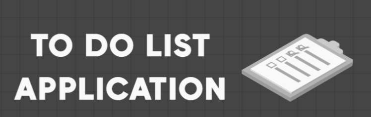

  

<h1 align = "center"> To Do List Application </h1>

   A Todo List App in HTML CSS & JavaScript 

  

 In this todo app, you can easily add, edit, or delete your task. There are filters button too that helps you to filter your tasks. The tasks you added on this todo app will be stored in the browser local storage so, it won't be removed on page refresh or tab close.

 

## Description

Once the user gets into this app. The user might not have any recently saved tasks. In order to enter the new task into the todo list. The user simply have to click on the input section and start typing. Once the user has typed everything, simply press the <strong>Enter Key</strong>. The data will be auomatically saved into the list of tasks and will be displayed on the page along with other tasks (if any exists). Along with the data, a number of functionalities will be provided to the user which we will talk about later. In the start, the status ofd the task is set to <strong>Pending</strong> which means this task needs to be done. Once the user has completed the task. In order to verify it, the user simply has to check the checkbox of the task. The <strong>Strike through</strong> line will indicate that this task has been completed by the user and in the backend, the status is changed from pending to <strong>Completed</strong>.  

  

## Features
 
Following are some of the new features and learning encountered while creating this amazing project:

- The data is being saved and retrieved from the **Local Storage** which means the data is not lost even after the page refresh.
- The is inserted on pressing the **Enter Key**, so no kind of button is needed here to insert the data.
  

## Resources
Follwing resources have been used in maing this project:
 
- [BrandCrowd](https://www.brandcrowd.com/) for making the logo of this web application.
- [FavIconConverter](https://favicon.io/favicon-converter/), to convert the image into the favicon.
- [Box Icons](https://boxicons.com/) for importing icons into the application.
- [Google Fonts](https://fonts.google.com/) is used for importing the fonts from **Poppins Family**.
  

## Demo
  

## Link To Video
  

## GUI

  

## Technology Stack

Follwing technologies have been used at the core of this application to make it stand in the market place:
 
- HTML
- CSS
- JavaScript
- Browser's Local Storage
  

## Advancement
  

## Deployment Details
 
The website is deployed using the free hosting provided by **Vercel**

  

  
Later on the link was customized using the well known url shortner and customizer **Rebrandly**:  

  

  

## Developer
Muhammad Abdullah Butt  
abdullahbutt12292210@gmail.com  
> [Instagram](https://www.instagram.com/abdullah.butt.22/) 
> [FaceBook](https://www.facebook.com/profile.php?id=100076291614529) 
> [YouTube](https://www.youtube.com/channel/UCnuOFQyMywg-KuoN-lmav1Q) 
> [Portfolio](https://rebrand.ly/muhammadabdullahPortfolio) 
> [Website](#)
